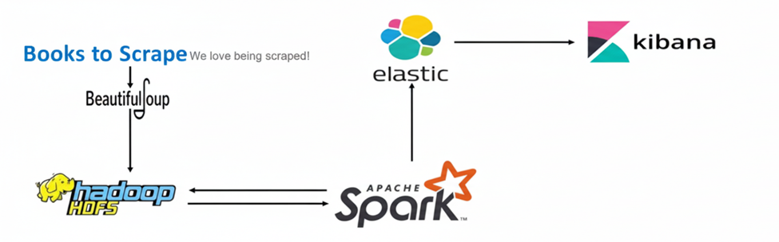

# Dự án Big Data: Books to Scrape

Dự án minh hoạ pipeline Big Data đơn giản với nguồn dữ liệu là website demo **books.toscrape.com**.

## 1. Luồng xử lý dữ liệu

1. **Crawler (Python)**
   - Script: `crawl/book.py`
   - Nhiệm vụ: crawl toàn bộ danh sách sách từ `books.toscrape.com`, lấy các trường:
     - `title`, `price`, `availability`, `rating`, `in_stock`, `category`.
   - Kết quả: ghi file JSON mảng tại `crawl/output/books_toscrape_raw.json`.

2. **Đưa dữ liệu thô lên HDFS**
   - Sau khi crawl xong:
   - Lệnh (chạy trong Hadoop):
     ```bash
     hdfs dfs -mkdir -p /data/raw
     hdfs dfs -put -f crawl/output/books_toscrape_raw.json /data/raw/
     ```

3. **Làm sạch dữ liệu bằng Spark**
   - Script: `spark/clean_books.py`
   - Cách chạy (PowerShell, từ thư mục `spark`):
     ```powershell
     .\run_clean_with_java11.cmd
     ```
   - Chức năng:
     - Đọc `hdfs://localhost:9000/data/raw/books_toscrape_raw.json`.
     - Chuẩn hoá các trường:
       - `price` -> số thực (double).
       - `rating` chữ (`One..Five`) -> số nguyên 1..5.
       - `title`, `category` -> trim khoảng trắng.
       - `in_stock` -> ép về boolean.
     - Chọn các cột cuối cùng: `title`, `price`, `rating`, `in_stock`, `category`.
     - Ghi dữ liệu sạch ra `hdfs://localhost:9000/data/clean/books` (JSON).

4. **Đẩy dữ liệu sạch sang Elasticsearch**
   - Script: `spark/spark_to_es.py`
   - Cách chạy (PowerShell, từ thư mục `spark`):
     ```powershell
     .\run_es_with_java11.cmd
     ```
   - Chức năng:
     - Đọc `hdfs://localhost:9000/data/clean/books`.
     - Ghi thêm bản Parquet tại `hdfs://localhost:9000/data/cleaned/books_cleaned.parquet`.
     - Index dữ liệu vào Elasticsearch (index `books`) bằng connector `elasticsearch-spark-30_2.12`.

5. **Trực quan hoá bằng Kibana**
   - Tạo **Data view** `books` với index pattern `books*`.
   - Sử dụng **Discover** và **Lens** để vẽ biểu đồ:
     - Số lượng sách theo `category`.
     - Giá trung bình theo `category`.
     - Phân bố `rating`.
     - Tỷ lệ `in_stock` theo `category` (biểu đồ tròn, stacked bar, ...).

## 2. Phiên bản môi trường

- Python: 3.11
- JDK hệ thống: OpenJDK 21 (dùng chung cho máy)
- JDK cho Spark: Eclipse Temurin OpenJDK 11.0.29 (được set trong `run_clean_with_java11.cmd` và `run_es_with_java11.cmd`)
- Hadoop HDFS: 3.3.6 (chạy local, NameNode `http://localhost:9870`)
- PySpark / Spark: client PySpark 3.3.3, Spark trên máy 4.1.0
- Elasticsearch: 8.13.2 (no security, `http://localhost:9200`)
- Kibana: 8.13.2 (`http://localhost:5601`)

## 3. Cấu trúc thư mục chính

- `crawl/`
  - `book.py` — crawler nguồn books.toscrape.com.
  - `output/books_toscrape_raw.json` — dữ liệu thô sau khi crawl.
- `spark/`
  - `clean_books.py` — script Spark làm sạch dữ liệu.
  - `spark_to_es.py` — script Spark đẩy dữ liệu sạch sang Elasticsearch.
  - `run_clean_with_java11.cmd` — batch file cấu hình JDK 11 và chạy clean.
  - `run_es_with_java11.cmd` — batch file cấu hình JDK 11 và chạy Spark -> ES.

Dự án này minh hoạ trọn vẹn một pipeline ETL đơn giản: **crawl → HDFS → Spark clean → Elasticsearch → Kibana** cho dữ liệu sách.