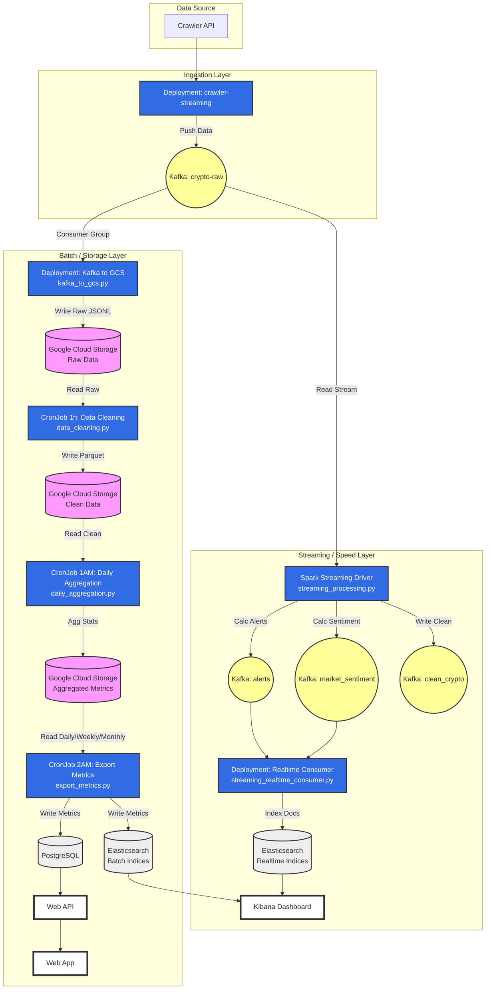

# Sơ đồ Kiến trúc Hệ thống Crypto Analytics

Dưới đây là sơ đồ luồng dữ liệu của hệ thống, bao gồm Streaming và Batch processing layers.

## Chi tiết các thành phần

### 1. Ingestion (Đầu vào)
*   **Crawler**: Chạy dưới dạng Deployment (`crawler-streaming`), liên tục lấy dữ liệu coin và đẩy vào Kafka topic `crypto-raw`.

### 2. Streaming Flow (Xử lý thời gian thực)
*   **Spark Structured Streaming**: 
    *   Deployment: `spark-streaming` chạy file `streaming_processing.py`.
    *   Logic: Đọc `crypto-raw`, tính toán pump/dump (Alerts) và xu hướng thị trường (Sentiment).
    *   Output: Đẩy ra Kafka topics `alerts`, `market_sentiment`, và `clean_crypto`.
*   **Realtime Consumer**:
    *   Deployment: `kafka-to-es-consumer` chạy file `streaming_realtime_consumer.py`.
    *   Logic: Đọc `alerts` và `market_sentiment` từ Kafka và ghi ngay lập tức vào **Elasticsearch**.
*   **Kibana**: Visualize dữ liệu realtime từ Elasticsearch.

### 3. Batch Flow (Xử lý định kỳ - Lưu trữ lâu dài)
*   **Kafka to GCS**:
    *   Deployment: `kafka-to-gcs` chạy file `hdfs/kafka_to_gcs.py` (chạy liên tục, không phải cron).
    *   Nhiệm vụ: Sync dữ liệu từ Kafka `crypto-raw` lưu trữ dạng file `.jsonl` phân vùng theo ngày/giờ trên **Google Cloud Storage (GCS)**.
*   **Data Cleaning (1 tiếng/lần)**:
    *   CronJob: `spark-clean-gcs-cronjob` chạy file `data_cleaning.py`.
    *   Nhiệm vụ: Đọc Raw GCS -> Làm sạch -> Ghi Clean Parquet GCS.
*   **Daily Aggregation (1h Sáng)**:
    *   CronJob: `spark-agg-gcs-cronjob` chạy file `daily_aggregation.py`.
    *   Nhiệm vụ: Thống kê dữ liệu (Daily, Weekly, Monthly) từ Clean GCS -> Ghi lại vào GCS (folder `aggregated`).
*   **Export Metrics (2h Sáng)**:
    *   CronJob: `spark-export-gcs-cronjob` chạy file `export_metrics.py`.
    *   Nhiệm vụ 1: Ghi vào **PostgreSQL** (Phục vụ Web API hiển thị báo cáo).
    *   Nhiệm vụ 2: Ghi vào **Elasticsearch** (Topic DAILY, WEEKLY, MONTHLY) để vẽ biểu đồ lịch sử trên Kibana.
